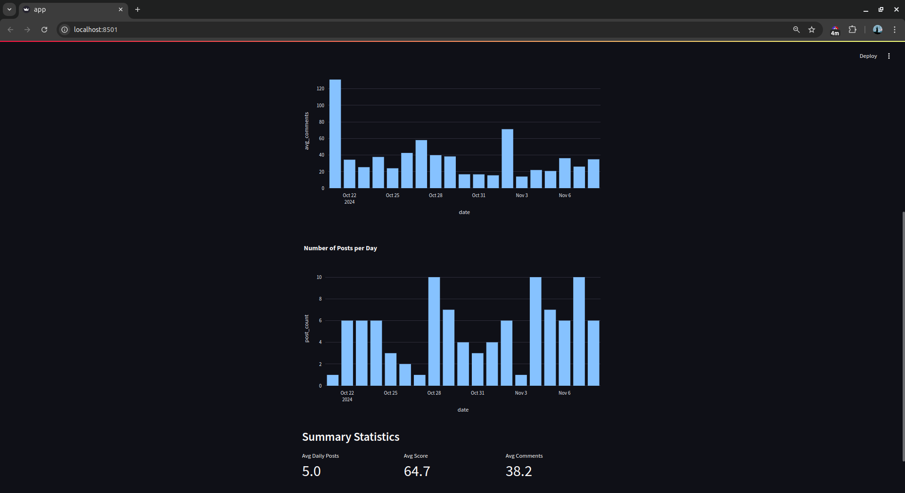
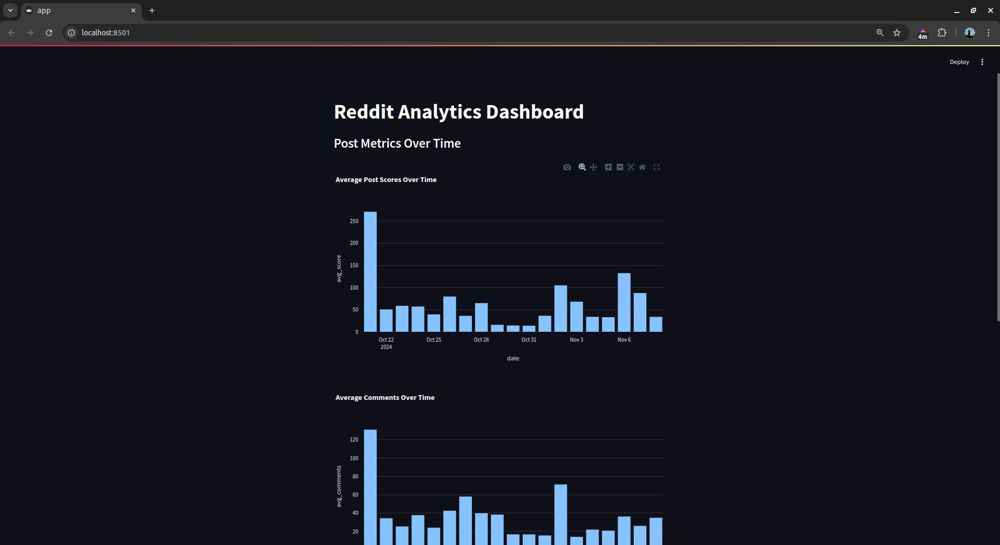

# Reddit Data Analysis Pipeline

A data pipeline that fetches Reddit data, processes it using PySpark, orchestrates workflows with Apache Airflow, and visualizes insights through a Streamlit dashboard.

### Requirements
Python 3.8+
Java 8+ (for PySpark)
Reddit API credentials
Sufficient disk space for data storage

### Installation

##### Clone the repository:
```bash
git clone <repository-url>
cd reddit_analytics
```

##### Create and activate a virtual environment:

```bash
python -m venv venv
source venv/bin/activate  # On Windows: .\venv\Scripts\activate
```

##### Install dependencies:

```bash
pip install -r requirements.txt
```

##### Create a .env file following sample.env:
```env
REDDIT_CLIENT_ID=your_client_id
REDDIT_CLIENT_SECRET=your_client_secret
REDDIT_USER_AGENT=your_user_agent
```

### Airflow Setup

##### Set the Airflow home directory:

```bash
export AIRFLOW_HOME=$(pwd)/airflow  # On Windows: set AIRFLOW_HOME=%CD%\airflow
```

##### Initialize the Airflow database:

```bash
airflow db init
```

##### Create an admin user:

```bash
airflow users create \
    --username admin \
    --firstname Admin \
    --lastname User \
    --role Admin \
    --email admin@example.com \
    --password admin
```

##### Start Airflow services (in separate terminal windows):

```bash
# Terminal 1 - Start the scheduler
airflow scheduler

# Terminal 2 - Start the webserver
airflow webserver
```

### Running the Pipeline

#### Access the Airflow web interface:

Open http://localhost:8080 in your browser
Log in with the admin credentials created earlier

#### Enable the Reddit analytics DAG:

Find 'reddit_analytics' in the DAGs list
Toggle the DAG to "On"
The DAG will run daily at midnight

#### Start the Streamlit dashboard:

```bash
cd dashboard
streamlit run app.py
```

Access the dashboard at http://localhost:8501

## Pipeline Components
### 1. Data Collection (fetch_reddit_data.py)

Fetches posts from specified subreddits
Collects post metadata, scores, and comments
Stores raw data in CSV format
Handles API rate limiting and errors

### 2. Data Processing (process_data.py)

Processes raw data using PySpark
Calculates daily statistics and trends
Performs subreddit analysis
Generates processed datasets for visualization

### 3. Dashboard (app.py)

Interactive data visualization
Trend analysis
Subreddit comparisons
Post engagement metrics



